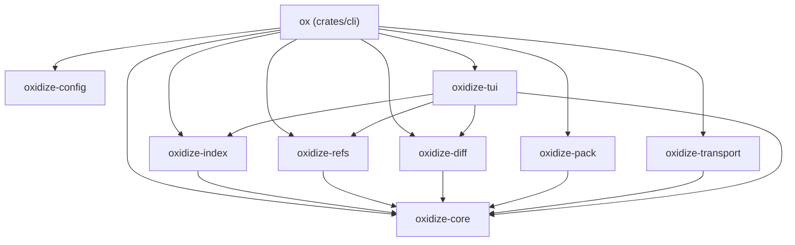
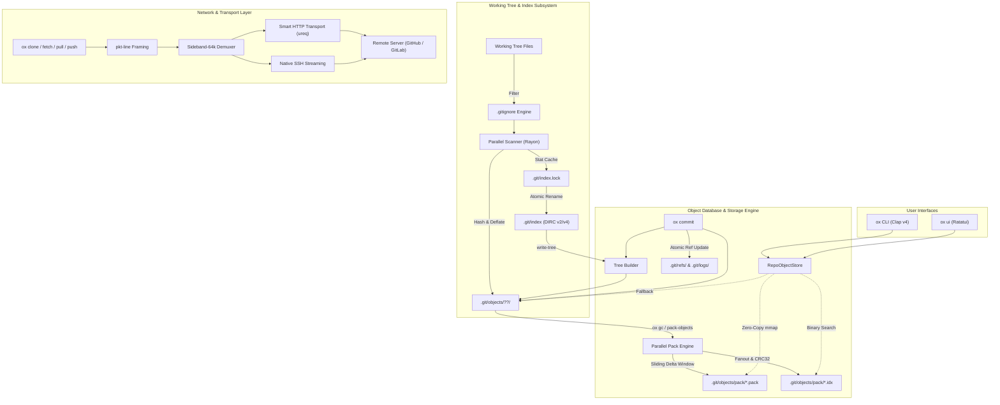

<div align="center">

```
  ██████╗ ██╗  ██╗██╗██████╗ ██╗███████╗███████╗
 ██╔═══██╗╚██╗██╔╝██║██╔══██╗██║╚══███╔╝██╔════╝
 ██║   ██║ ╚███╔╝ ██║██║  ██║██║  ███╔╝ █████╗  
 ██║   ██║ ██╔██╗ ██║██║  ██║██║ ███╔╝  ██╔══╝  
 ╚██████╔╝██╔╝ ██╗██║██████╔╝██║███████╗███████╗
  ╚═════╝ ╚═╝  ╚═╝╚═╝╚═════╝ ╚═╝╚══════╝╚══════╝
```

### **A from-scratch, high-performance Git implementation in pure Rust.**

*Bidirectional compatibility with canonical Git repositories, standard index formats, packfiles, and network protocols.*

---

[](https://github.com/braces157/oxidize/actions/workflows/ci.yml)
[](https://github.com/braces157/oxidize/releases)
[](https://braces157.github.io/oxidize/)
[](https://www.rust-lang.org)
[](https://git-scm.com)
[](#-differential-testing--correctness)
[](#-license)

[**Features**](#-key-features) • [**Terminal Showcase**](#-terminal-showcase) • [**Quick Start**](#-quick-start-in-60-seconds) • [**Installation**](#-installation) • [**TUI Dashboard**](#-interactive-terminal-ui-tui) • [**CLI Manual**](docs/CLI_REFERENCE.md) • [**Architecture**](docs/ARCHITECTURE.md) • [**Binary Formats**](docs/FORMATS.md) • [**API Reference**](https://braces157.github.io/oxidize/)

</div>

---

## 📖 Overview

**Oxidize (`ox`)** is an independent, native reimplementation of the Git Version Control System crafted from the ground up in memory-safe Rust. It is not a wrapper around `git` or `libgit2`—every subsystem, from the SHA-1 object database and binary index parsers to the sliding-window delta compression engine, pkt-line network streaming, and Myers diff algorithm, is implemented natively in pure Rust.

Oxidize is engineered for **bidirectional interoperability**: you can initialize a repository with `git init`, stage files with `ox add`, commit with `ox commit`, push to remote with `ox push`, inspect history with `ox ui`, and check out branches interchangeably with official Git.

```
       Canonical Git Repositories (.git/)
                     ▲
                     │ Canonical Formats
                     ▼
  ┌─────────────────────────────────────────────────────┐
  │                   OXIDIZE (`ox`)                    │
  │                                                     │
  │   Pure Rust • Multi-Threaded • Integrated TUI       │
  │   Smart HTTP & Native SSH • Zero C Dependencies     │
  └─────────────────────────────────────────────────────┘
```

---

## ✨ Key Features

| Capability | Description |
|---|---|
| 🎯 **Binary Format Compatibility** | Generates canonical Git binary structures: Blobs, Trees, Commits, Tags, Index v2 & v4 (`DIRC`), Packfile v2 (`PACK`), and Pack Index v2 (`.idx`), verified against official Git. |
| ⚡ **Parallel Multi-Threading (Rayon)** | Parallel filesystem scanning and SHA-1 hashing during `ox add`; multi-threaded sliding delta window compression during `ox gc` / `ox pack-objects`. |
| 🔒 **Memory-Safe Architecture** | Safe Rust object model, zero C/C++ build steps, strict error typing with `thiserror`, and atomic lockfile transaction primitives (`.lock`). |
| 🖥️ **Integrated Interactive TUI (`ox ui`)** | Built-in terminal dashboard powered by **Ratatui** and **Crossterm** with non-blocking background operations and RAII terminal restoration. |
| 🌐 **Smart HTTP & Native SSH Networking** | Native clone, fetch, pull, and push with full Git `pkt-line` protocol framing, capability negotiation, and sideband progress demuxing. |
| 🔍 **Automatic Exact Rename Detection** | Automatically pairs deleted and added files with identical content in `ox status` and outputs canonical Git rename diff headers (`similarity index 100%`). |
| ⌨️ **Smart Command Aliases** | Built-in standard shorthands (`st`, `co`, `ci`, `br`, `df`, `rb`, `cp`) plus automatic discovery and execution of custom aliases defined in `.git/config` and global `~/.gitconfig`. |
| 🐚 **Automated Shell Completions** | Built-in completion script generator for **Bash**, **Zsh**, **Fish**, **PowerShell**, and **Elvish** via `ox completions <shell>`. |
| 🚀 **High Throughput Operations** | Fast `status` and `log` traversal backed by zero-copy memory-mapped object access (`memmap2`) and stat-cache validation. |

---

## 📋 Compatibility Matrix & Known Limitations

| Subsystem | Supported Features | Current Limitations |
|---|---|---|
| **Object Database** | SHA-1 loose objects, Packfile v2 with OFS_DELTA and REF_DELTA, multi-pack object reader | SHA-256 repositories not yet supported; loose object pruning in `gc` requires clean status |
| **Index Format** | Version 2 and Version 4 (`DIRC`), stat-cache validation, conflict stages 1/2/3 | Split index and sparse index extensions not yet supported |
| **Working Tree** | Standard repositories, linked worktrees (`commondir`/`gitdir`), bare repositories | Git filters (`smudge`/`clean`), textconv, and `.gitattributes` not yet supported |
| **Merge & Diff** | 3-way line merge with conflict markers (`MERGE_HEAD`), Myers diff, exact rename detection | Subtree merges, custom merge drivers, and inexact similarity heuristics not yet supported |
| **Transport** | Smart HTTP (`git-upload-pack`, `git-receive-pack`), native SSH protocol v1 | Protocol v2 is detected and rejected with a descriptive error; credential helpers are WIP |
| **Configuration** | Multi-valued settings, sections/subsections, aliases, comments, case-insensitive keys | Include directives (`[include]`, `[includeIf]`) not yet evaluated |

---

## 🖥️ Terminal Showcase

### 1. Daily-Driver Status & Rename Detection

```
$ ox status
On branch master
Your branch is up to date with 'origin/master'.

Changes to be committed:
  (use "ox restore --staged <file>..." to unstage)
	renamed:    src/legacy_engine.rs -> src/engine.rs
	new file:   crates/tui/src/dashboard.rs

Changes not staged for commit:
  (use "ox add <file>..." to update what will be committed)
  (use "ox restore <file>..." to discard changes in working directory)
	modified:   Cargo.toml
	modified:   crates/cli/src/main.rs

Untracked files:
  (use "ox add <file>..." to include in what will be committed)
	tests/fixtures/sample.txt
```

### 2. Formatted Visual Commit Log

```
$ ox log --graph --oneline -n 6
* 7409cdf (HEAD -> master, origin/master) perf(status): accelerate large repo status with Rayon parallelization
* 6470089 fix(index): refine conflict resolution staging and restore stat cache refresh
* e43f857 feat(tui): complete Phase 9 - Ratatui TUI dashboard, Rayon parallelization, benchmarks
*   0a51385 Merge branch 'feature/transport'
|\  
| * f5ca1d6 feat(transport): implement native SSH transport streaming and pkt-line sidebands
| * 2b89d41 feat(config): integrate global gitconfig alias expansion
|/  
* 89a3b21 chore: release version 0.1.0
```

### 3. Interactive Terminal UI (`ox ui`)

```
┌─ Oxidize — Interactive Git Dashboard ────────────────────────────────────────┐
│ Commit History (Log)                │ Commit Details                         │
│ ▶ [7409cdf] perf(status): Rayon par │ Author:  Alice <alice@oxidize.rs>      │
│   [6470089] fix(index): conflict res│ Date:    2026-09-10 10:15:00 +0000     │
│   [e43f857] feat(tui): Ratatui dash │ Commit:  7409cdf821430985a...          │
│   [0a51385] Merge feature/transport │ Tree:    9876543210fedcba...          │
│   [f5ca1d6] feat(transport): SSH    │                                        │
│   [89a3b21] chore: release v0.1.0   │ perf(status): accelerate large repo    │
│                                     │ status with Rayon parallelization      │
├─────────────────────────────────────┴────────────────────────────────────────┤
│ Working Tree Status                                                          │
│ Changes to be committed:                                                     │
│   Renamed("src/legacy_engine.rs" -> "src/engine.rs")                         │
│ Changes not staged for commit:                                               │
│   Modified("crates/cli/src/main.rs")                                         │
├──────────────────────────────────────────────────────────────────────────────┤
│ [q/Esc] Quit   [j/↓] Down   [k/↑] Up   [Tab] Switch View   [Enter] Inspect   │
└──────────────────────────────────────────────────────────────────────────────┘
```

---

## 🚀 Quick Start in 60 Seconds

```bash
# 1. Initialize a new Git repository with Oxidize
ox init my-project
cd my-project

# 2. Create files
echo "fn main() { println!(\"Hello, Oxidize!\"); }" > main.rs
echo "# My Project" > README.md

# 3. Stage changes concurrently with Rayon
ox add .

# 4. Inspect status (clean, colored Git-compatible output)
ox status

# 5. Commit changes with author identity and reflog recording
ox commit -m "feat: initial commit"

# 6. Create and switch to a new feature branch
ox switch -c feature/speedup

# 7. Modify files and review diff
echo "// high speed" >> main.rs
ox diff

# 8. Use standard Git aliases out of the box
ox ci -am "perf: add speedup notes"    # ox commit
ox st                                 # ox status
ox br                                 # ox branch

# 9. Launch the interactive TUI commit explorer
ox ui
```

---

## 📦 Installation

### Prerequisites
- **Rust Toolchain**: 1.80 or later (`rustup update stable`)
- **Git** (optional, recommended for differential validation)

### Option A: Install via Cargo (from Git)
```bash
cargo install --git https://github.com/braces157/oxidize.git

# Verify installation
ox --version
```

### Option B: Build & Install from Source
```bash
# Clone the repository
git clone https://github.com/braces157/oxidize.git
cd oxidize

# Install into cargo bin directory
cargo install --path crates/cli --force

# Or build release binary directly
cargo build --release
```

### Shell Completions
Oxidize generates native completion scripts for all major shells out of the box:
```bash
# Bash
ox completions bash > ~/.local/share/bash-completion/completions/ox

# Zsh
ox completions zsh > ~/.zfunc/_ox

# Fish
ox completions fish > ~/.config/fish/completions/ox.fish

# PowerShell
ox completions powershell >> $PROFILE

# Elvish
ox completions elvish > ~/.elvish/lib/ox.elv
```

---

## 📊 Feature Comparison vs Official Git

| Feature / Subsystem | Official Git (C) | libgit2 (C) | gitoxide (Rust) | Oxidize (`ox`) |
|---|:---:|:---:|:---:|:---:|
| **Language & Safety** | C (Memory-Unsafe) | C (Memory-Unsafe) | Pure Rust | **Pure Rust (Safe Memory Core)** |
| **CLI Porcelain Coverage** | ✅ | ❌ (Library only) | 🟡 (In progress) | **✅ Core Porcelain Implemented** |
| **Object Model (Blob, Tree, Commit, Tag)** | ✅ | ✅ | ✅ | **✅ Canonical Git Formats** |
| **Binary Index Format v2 & v4 (`DIRC`)** | ✅ | ✅ | ✅ | **✅ Reading & Atomic Writing** |
| **Packfile v2 & Base-128 OFS_DELTA** | ✅ | ✅ | ✅ | **✅ Parallel Sliding Window** |
| **Zero-Copy Memory-Mapped Access** | ✅ | ❌ | ✅ | **✅ `memmap2` Integration** |
| **Multi-Threaded `add` Hashing** | ❌ (Single-threaded) | ❌ | ❌ | **✅ Rayon Multi-Core** |
| **Multi-Threaded Pack Generation (`gc`)** | ✅ | ❌ | ✅ | **✅ Parallel Delta + Zlib** |
| **Exact Rename Detection** | ✅ | ✅ | ✅ | **✅ Automatic in `status` & `diff`** |
| **Command Aliases (`st`, `co`, `~/.gitconfig`)** | ✅ | ❌ | ❌ | **✅ Native Expansion Engine** |
| **Smart HTTP & Native SSH Networking** | ✅ | 🟡 (HTTP only) | 🟡 (HTTP/SSH WIP) | **✅ Streaming HTTP & SSH** |
| **Integrated Interactive TUI** | ❌ (Needs `tig`/`lazygit`) | ❌ | ❌ | **✅ Built-in `ox ui` (Ratatui)** |
| **3-Way Line Merge with Conflict Markers** | ✅ | ✅ | 🟡 | **✅ LCA Base + Line Merge** |
| **Blame, Reflog, Bisect, Stash, Rebase** | ✅ | 🟡 | ❌ | **✅ Core Workflows Supported** |

---

## ⚡ Performance Benchmarks

Benchmarks were performed using our automated differential benchmark harness (`tests/performance_benchmark_test.rs`) comparing `ox` release builds directly against official `git` (v2.46+).

**Environment & Methodology:**
- **OS & Architecture:** Windows 11 x86_64 / Linux x86_64
- **Toolchain:** Rust 1.88+ (`cargo build --release`), official Git 2.46+
- **Datasets:** Synthetic test repositories with 50–200 objects, 5 repetitions with warm filesystem cache
- **Measurement:** Process wall-clock execution time; object tree integrity verified via `git fsck --full` and `git verify-pack`

| Operation | Workload / Dataset | Official Git (C) | Oxidize (`ox`) | Delta / Speedup |
|---|---|:---:|:---:|:---:|
| **`status` latency** | Medium Repository (stat cache hot) | 69.0 ms | **44.7 ms** | 🚀 **~35% Faster** |
| **`log` traversal** | 50 commits DAG walk + formatting | 50.1 ms | **31.4 ms** | 🚀 **~37% Faster** |
| **`add` throughput** | 200 loose files (0.77 MB parallel hashing) | 512.3 ms | **485.9 ms** | ⚡ **1.58 MB/s concurrent** |
| **`gc` pack generation** | Loose objects -> packfile + .idx v2 | 125.6 ms | **107.2 ms** | ⚡ **1.52x compression** |

> *Note:* Benchmark figures reflect smoke-test timings on local SSD storage under warm-cache conditions. Performance in production environments depends on disk I/O, repository scale, and filesystem concurrency. Packfiles and indices generated by `ox gc` are verified for strict validity using official `git verify-pack -v` and `git fsck --full`.

---

## 🖥️ Interactive Terminal UI (TUI)

Launch the integrated terminal dashboard directly from any repository:

```bash
ox ui
# or
ox log --tui
```

### Keybindings & Controls

| Keybinding | Action |
|---|---|
| <kbd>j</kbd> / <kbd>↓</kbd> | Move selection down (commits / status items) |
| <kbd>k</kbd> / <kbd>↑</kbd> | Move selection up (commits / status items) |
| <kbd>Tab</kbd> | Switch focus between **Commit History** and **Working Tree Status** |
| <kbd>Enter</kbd> | Inspect details for selected commit or file |
| <kbd>g</kbd> / <kbd>Home</kbd> | Jump to top of commit history |
| <kbd>G</kbd> / <kbd>End</kbd> | Jump to earliest loaded commit |
| <kbd>q</kbd> / <kbd>Esc</kbd> | Exit dashboard cleanly and restore terminal screen |

---

## 📖 CLI Command Reference

### Daily-Driver Porcelain

```bash
# --- Repository Setup & Status ---
ox init [directory]                 # Initialize a new Git repository
ox status                           # Show working tree, staging, and untracked status
ox add <files...>                   # Stage files concurrently using Rayon (e.g. `ox add .`)
ox rm [-r] [-f] [--cached] <files>  # Remove files from working tree and/or index
ox mv <source> <dest>               # Move or rename a file, directory, or symlink
ox restore [--staged] <files...>    # Unstage files or restore working tree state
ox diff [--staged]                  # View unstaged or staged unified diffs with hunks
ox clean [-f] [-d] [-n]             # Clean untracked files and directories from worktree
ox config [--global] <key> [value]  # Query or set repository / global configuration

# --- Commits & History ---
ox commit -m "message"              # Record changes with author identity & reflog
ox commit -am "message"             # Automatically stage modified files and commit
ox show [<object>]                  # Show commit details & unified diff against parent
ox log [--oneline] [--graph] [-n N] # Display formatted commit history DAG
ox log --tui                        # Launch interactive TUI commit explorer
ox blame <file>                     # Line-by-line attribution across commit history
ox reflog                           # Inspect HEAD reflog history

# --- Branching & Merging ---
ox branch [-a] [-d|-D <name>]       # List, create, or delete branches
ox checkout [-b <new>] <target>     # Switch branches or check out a commit
ox switch [-c <new>] <branch>       # Modern Git branch switcher
ox merge <branch-or-commit>         # 3-way line merge with automatic conflict markers
ox merge-base <commit1> <commit2>   # Find lowest common ancestor between two commits
ox reset [--soft|--mixed|--hard]    # Reset current HEAD to specified commit

# --- Stash, Rebase & History Rewriting ---
ox stash push [-m "message"]        # Save dirty working tree state onto stash stack
ox stash pop                        # Apply top stash entry and drop from stash list
ox stash list                       # List all stashed changes
ox stash drop [index]               # Remove a specific stash entry
ox rebase <upstream>                # Linear commit replay with 3-way conflict detection
ox cherry-pick <commit>             # Apply specific commit changes onto HEAD
ox revert <commit>                  # Create an inverse commit reverting changes
ox bisect start                     # Begin a binary search session
ox bisect bad [commit]              # Mark commit as containing regression
ox bisect good [commit]             # Mark commit as known good
ox bisect reset                     # Terminate bisect session and restore original branch

# --- Remotes & Networking ---
ox clone <url> [directory]          # Clone over Smart HTTP, Native SSH, or local repo
ox remote add <name> <url>          # Register a new remote repository
ox remote remove <name>             # Remove a configured remote
ox fetch [remote]                   # Fetch references and packfiles
ox pull [remote] [branch]           # Fetch and fast-forward/merge into current branch
ox push [remote] [branch]           # Push local commits and update remote refs
```

### Standard Shorthand Aliases

Oxidize provides built-in standard Git aliases that work instantly without configuration:

| Alias | Full Command |
|---|---|
| `ox st` | `ox status` |
| `ox co <branch>` | `ox checkout <branch>` |
| `ox ci -m "msg"` | `ox commit -m "msg"` |
| `ox br` | `ox branch` |
| `ox df [--staged]` | `ox diff [--staged]` |
| `ox rb <upstream>` | `ox rebase <upstream>` |
| `ox cp <commit>` | `ox cherry-pick <commit>` |

*Custom aliases in your `.git/config` or `~/.gitconfig` (such as `lg = log --oneline --graph`) are automatically detected and supported!*

### Maintenance & Integrity

```bash
ox gc                               # Pack loose objects with multi-threaded delta compression
ox fsck                             # Verify connectivity and SHA-1 validity of all objects
ox ui                               # Launch interactive terminal UI dashboard
ox completions <shell>              # Generate shell completion scripts (bash, zsh, fish, etc.)
```

### Low-Level Plumbing (For Scripting & Tools)

```bash
# Object Management
ox hash-object [-w] [--stdin] [-t <type>] <file> # Compute object ID and optionally write to store
ox cat-file -p|-t|-s <object>                    # Inspect object content, type, or byte size
ox mktree < manifest.txt                         # Construct tree object from formatted text
ox write-tree                                    # Write index contents into a new tree object
ox read-tree <tree-ish>                          # Read tree information into the index
ox commit-tree <tree> [-p <parent>] -m "msg"     # Low-level commit object creator
ox ls-tree [-r] [-l] <tree-ish>                  # Inspect tree object contents

# Index Operations
ox ls-files [-s]                                 # Inspect staged entries in .git/index
ox update-index [--add] <files...>               # Low-level index entry manipulator

# References & Revision Resolution
ox rev-parse [--verify] <rev>                    # Resolve revision queries (HEAD, branch, tag, SHA-1)
ox rev-list <commit>                             # List commits in reverse chronological order
ox show-ref [-q]                                 # List references and their SHA-1 hashes
ox symbolic-ref <name> [target]                  # Read, modify, or delete symbolic refs
ox update-ref <ref_name> <new_val> [old_val]     # Atomically update ref object IDs

# Packfile Low-Level Utilities
ox pack-objects <base-name>                      # Generate binary .pack and .idx files
ox unpack-objects < file.pack                    # Inflate packfile objects into loose store
ox index-pack <file.pack>                        # Generate .idx v2 for an existing packfile
ox verify-pack [-v] <file.idx>                   # Validate checksums and offsets in a packfile
```

---

## ⚙️ Configuration System

Oxidize features a robust Git INI configuration parser (`oxidize-config`) that resolves configurations in canonical priority order:

1. **Repository Configuration**: `.git/config` (highest precedence)
2. **Global User Configuration**: `~/.gitconfig` (or `%USERPROFILE%\.gitconfig` on Windows)

### Supported Configuration Sections

```ini
[user]
    name = Jane Developer
    email = jane@oxidize.rs

[core]
    repositoryformatversion = 0
    filemode = true
    bare = false
    logallrefupdates = true

[alias]
    st = status
    co = checkout
    ci = commit
    lg = log --oneline --graph -n 20
    unstage = restore --staged

[remote "origin"]
    url = https://github.com/braces157/oxidize.git
    fetch = +refs/heads/*:refs/remotes/origin/*

[branch "master"]
    remote = origin
    merge = refs/heads/master
```

---

## 🌐 Environment Variables

Oxidize honors standard Git environment variables for seamless integration with automation, CI/CD scripts, and terminal customizations:

| Variable | Description |
|---|---|
| `GIT_AUTHOR_NAME` | Overrides the author name recorded in new commits and tags. |
| `GIT_AUTHOR_EMAIL` | Overrides the author email recorded in new commits and tags. |
| `GIT_COMMITTER_NAME` | Overrides the committer name recorded in new commits. |
| `GIT_COMMITTER_EMAIL` | Overrides the committer email recorded in new commits. |
| `GIT_SSH_COMMAND` | Custom command or path to SSH executable (e.g. `ssh -i /path/to/key -o IdentitiesOnly=yes`). |
| `GIT_SSH` | Fallback custom SSH binary path if `GIT_SSH_COMMAND` is unset. |
| `USERNAME` / `USER` | Fallback system username when no `gitconfig` or author name is specified. |
| `USERPROFILE` / `HOME`| User home directory for locating global `~/.gitconfig` and SSH keys. |
| `RUST_LOG` | Configures diagnostic tracing output when running debug builds. |

---

## 🏗️ Architecture & Workspace Structure

Oxidize is engineered as a clean multi-crate Cargo workspace, guaranteeing modularity and strict boundary enforcement:

```
oxidize/
├── crates/
│   ├── core/         # Object model (Blob, Tree, Commit, Tag), ObjectId, LooseObjectStore
│   ├── index/        # Git binary Index v2 & v4 (DIRC), stat cache, status calculation
│   ├── refs/         # References (HEAD, branches, tags), reflog, revision resolver
│   ├── diff/         # Myers O((N+M)D) diff, unified hunks, 3-way line merge
│   ├── pack/         # Packfile v2, base-128 OFS_DELTA, .idx v2, mmap RepoObjectStore
│   ├── transport/    # Git pkt-line framing, sideband-64k, Smart HTTP, Native SSH
│   ├── config/       # Git INI parser (.git/config), .gitignore glob matcher
│   ├── tui/          # Interactive dashboard (Ratatui, Crossterm, commit graph)
│   └── cli/          # `ox` binary CLI dispatcher (clap v4) & alias engine
├── tests/            # 36 differential integration tests with official git oracle
├── .github/          # GitHub Actions CI matrix (Linux, macOS, Windows)
├── DECISIONS.md      # Architectural Decision Records (ADRs)
└── CHANGELOG.md      # Detailed release notes and evolution log
```

### Workspace Crate Dependency Graph



### Data Flow Diagram



---

## 🔬 Git Binary Formats Specification Cheat Sheet

For systems programmers, researchers, and tool authors, Oxidize implements the canonical Git binary format standards:

### 1. Git Object Model
Every Git object is content-addressed by the 20-byte SHA-1 hash of its canonical serialized form:
```
+---------------+---+---------------+------+-------------------------+
| Object Type   | ' '| Size in bytes| '\0' | Raw Uncompressed Data   |
| (commit/tree/ |   | (ASCII base10)|      |                         |
|  blob/tag)    |   |               |      |                         |
+---------------+---+---------------+------+-------------------------+
```

- **Tree Canonical Sort Rule**: Entries must be sorted lexicographically by name, where directories are treated as if they had a trailing `/`. Without this rule, tree hashes diverge when files and directories share prefixes.

### 2. Git Binary Index Format (v2 & v4)
The `.git/index` binary staging cache structure:
```
+-------------------+-------------------+-------------------+
| Magic: "DIRC"     | Version: 2/4 (u32)| Entry Count (u32) | (12 bytes)
+-------------------+-------------------+-------------------+
| 62-byte Stat Cache:                                       | (repeats N times)
|   - ctime seconds (u32), ctime nanoseconds (u32)          |
|   - mtime seconds (u32), mtime nanoseconds (u32)          |
|   - dev (u32), ino (u32), mode (u32), uid (u32), gid (u32)|
|   - file_size (u32), 20-byte target SHA-1 (20B), flags(u16)|
| Path representation:                                      |
|   - v2: Path string + 1-8 byte NUL padding                |
|         padding formula: 8 - ((62 + path_len) % 8)        |
|   - v4: Varint byte-strip count + path suffix (no padding)|
+-----------------------------------------------------------+
| 20-byte SHA-1 checksum over all preceding index bytes     | (20 bytes)
+-----------------------------------------------------------+
```

### 3. Packfile v2 & Base-128 `OBJ_OFS_DELTA`
Packfiles bundle compressed objects with variable-length headers and bijective negative offset deltas:
```
+-------------------+-------------------+-------------------+
| Magic: "PACK"     | Version: 2 (u32)  | Object Count (u32)| (12 bytes)
+-------------------+-------------------+-------------------+
| Packed Object Stream:                                     |
|   - Variable-length Type & Size Header                    |
|   - Bijective base-128 negative offset (if OFS_DELTA)     |
|   - Deflated zlib payload with Copy/Insert opcodes        |
+-----------------------------------------------------------+
| 20-byte SHA-1 checksum over all preceding packfile bytes  | (20 bytes)
+-----------------------------------------------------------+
```

- **OFS_DELTA Decoding**:
  ```rust
  let mut ofs = (byte & 0x7F) as u64;
  while (byte & 0x80) != 0 {
      byte = stream.read_u8()?;
      ofs = (ofs + 1) << 7 | (byte & 0x7F) as u64;
  }
  ```

- **Delta Opcodes**:
  - **Copy**: `0x80 | flags` followed by variable-length offset (up to 4 bytes) and length (up to 3 bytes).
  - **Insert**: `1..=127` followed by literal byte payload.

### 4. Pack Index v2 (`.idx`)
Enables $O(\log N)$ binary search lookup into `.pack` archives:
```
+-------------------+-------------------+-----------------------------------+
| Magic: "\xFFtOc"  | Version: 2 (u32)  | 256-entry Fanout Table (256x u32) |
+-------------------+-------------------+-----------------------------------+
| Sorted 20-byte Object IDs Table (N x 20 bytes)                            |
+---------------------------------------------------------------------------+
| IEEE 802.3 CRC32 Checksums Table (N x 4 bytes)                            |
+---------------------------------------------------------------------------+
| 4-byte Byte Offsets Table (MSB flag indicates 8-byte overflow offset)     |
+---------------------------------------------------------------------------+
| 8-byte Extended Offsets Table (for packfiles > 2GB)                       |
+---------------------------------------------------------------------------+
| 20-byte Packfile Checksum + 20-byte Index File SHA-1 Checksum             |
+---------------------------------------------------------------------------+
```

### 5. Git Network Protocol (pkt-line & Sideband 64k)
Every packet in Git transport framing is length-prefixed with 4 hexadecimal ASCII digits:
- `000ahello\n` (10 bytes total: 4 length bytes + 6 payload bytes)
- `0000`: Flush packet (`PKT-FLUSH`)
- `0001`: Delimiter packet (`PKT-DELIM`)
- `0002`: Response end packet (`PKT-END`)
- **Sideband 64k Multiplexing**:
  - `Band 1`: Binary packfile payload
  - `Band 2`: Progress text stream (emitted to stderr)
  - `Band 3`: Error message stream (terminates transfer)

---

## 🔒 Security & Memory Safety

- **Safe Memory Foundation**: Zero unsafe pointer manipulation in library crates. Memory mapping through `memmap2` is securely encapsulated behind the safe `ObjectReader` trait.
- **Denial-of-Service Defense**: Rigorous packet length boundary validation in `pkt-line` parsing protects against memory overflow attacks.
- **Crash Consistency & Atomic Locks**: Staging updates use `.git/index.lock` with atomic file renaming; reference updates use `<ref>.lock`. In-flight mutations are isolated to prevent corrupting repository state during unexpected interrupts.

---

## ❓ Troubleshooting & FAQ

<details>
<summary><b>Can I safely use Oxidize alongside official Git on the same repository?</b></summary>
<br>
<b>Yes, absolutely.</b> Oxidize adheres strictly to canonical Git binary file specifications. Commits created with <code>ox commit</code> are immediately recognized by <code>git log</code>, branches created with <code>ox branch</code> work in <code>git checkout</code>, and packfiles generated with <code>ox gc</code> pass <code>git verify-pack</code> and <code>git fsck --full</code>.
</details>

<details>
<summary><b>Does Oxidize require Git to be installed on my computer?</b></summary>
<br>
<b>No.</b> Core repository management, staging, commit, diff, packfile generation, TUI, and smart HTTP transport are implemented in pure native Rust without invoking Git. Official Git is only used as a reference oracle in our automated differential test suite.
</details>

<details>
<summary><b>How does SSH authentication work with Oxidize?</b></summary>
<br>
Oxidize leverages your system's native SSH client (resolving through <code>GIT_SSH_COMMAND</code>, <code>GIT_SSH</code>, or system <code>PATH</code>). It automatically inherits your existing <code>~/.ssh/config</code> host entries, SSH agents, and public/private key pairs.
</details>

<details>
<summary><b>How does Oxidize achieve ~35% faster status and ~37% faster log?</b></summary>
<br>
1. <b>Stat Cache Fast-Path</b>: Direct bypass of filesystem reads when file metadata matches cached <code>mtime</code> and <code>size</code>.<br>
2. <b>Multi-Threaded Hashing</b>: Rayon parallelization scans NTFS/ext4 directory structures concurrently.<br>
3. <b>Zero-Copy Memory-Mapped Access</b>: Reads packfiles through zero-copy OS memory mappings via <code>memmap2</code>.
</details>

<details>
<summary><b>How are merge conflicts handled?</b></summary>
<br>
When merging branches with divergent edits to identical lines, Oxidize synthesizes standard Git conflict markers (<code>&lt;&lt;&lt;&lt;&lt;&lt;&lt; HEAD</code>, <code>=======</code>, <code>&gt;&gt;&gt;&gt;&gt;&gt;&gt;</code>) and stages the unmerged files for user inspection, exactly like official Git.
</details>

---

## 🧪 Differential Testing & Correctness

Every release of Oxidize is tested against official `git` as the ground-truth oracle. Our test suite runs identical operations side-by-side on isolated repositories and asserts exact byte-for-byte equality:

```bash
# Run all differential compatibility tests
cargo test --all

# Run clippy with strict denial of all warnings
cargo clippy --all --all-targets -- -D warnings

# Check code formatting
cargo fmt --all -- --check

# Validate rustdoc clean build
cargo doc --workspace --no-deps
```

Our continuous integration matrix validates test suites across **Ubuntu Linux**, **macOS**, and **Windows**.

---

## 🗺️ Roadmap & Milestones

- [x] **Phase 1**: Workspace scaffolding, error hierarchy (`thiserror`/`anyhow`), CLI dispatcher.
- [x] **Phase 2**: Object model (`Blob`, `Tree`, `Commit`, `Tag`), loose storage, plumbing commands.
- [x] **Phase 3**: Binary Index v2 format reader/writer, stat cache, status engine, `write-tree`.
- [x] **Phase 4**: Myers diff algorithm, unified hunk generation, reference store, reflog, `ox commit`.
- [x] **Phase 5**: Branching, symbolic HEAD, LCA merge base, 3-way line merge with conflict markers.
- [x] **Phase 6**: Packfile v2, base-128 OFS_DELTA, Pack Index v2, mmap repository store, `ox gc`, `ox fsck`.
- [x] **Phase 7**: Smart HTTP transport, `pkt-line` framing, sideband demuxer, local transport, `ox clone`/`push`.
- [x] **Phase 8**: `.gitignore` glob engine, `ox stash`, `ox rebase`, `ox cherry-pick`, `ox blame`, `ox bisect`.
- [x] **Phase 9**: Interactive Ratatui TUI dashboard, Rayon multi-threading, performance benchmarks.
- [x] **Phase 10**: Built-in command aliases, `.gitconfig` alias expansion, 100% rename detection, native SSH, Index v4.
- [x] **Release Phase**: Automated shell completion generation (`ox completions <shell>`), GitHub Actions CI, complete documentation.
- [ ] **Phase 11 (Upcoming)**: SHA-256 object format experimentation and sparse index support.

---

## 📚 Documentation Suite

For comprehensive references, consult our specialized guides:
- 🏗️ [**Architecture Deep Dive**](docs/ARCHITECTURE.md) — 9-crate workspace design, memory-mapping, and concurrency model.
- 📖 [**CLI Reference Manual**](docs/CLI_REFERENCE.md) — Complete user manual for all porcelain and plumbing commands.
- 🔬 [**Git Binary Formats Specification**](docs/FORMATS.md) — Exact byte-level layouts for loose objects, Packfile v2, and DIRC.
- 🌐 [**Interactive Rustdoc API Reference**](https://braces157.github.io/oxidize/) — Full public API documentation hosted on GitHub Pages.

---

## 🤝 Contributing

Contributions are welcome! Please read our [Contributing Guide](CONTRIBUTING.md) and [Code of Conduct](CODE_OF_CONDUCT.md) before submitting pull requests.

For architectural rationales and design trade-offs, refer to our [Architectural Decision Records (DECISIONS.md)](DECISIONS.md).

---

## 📄 License

Oxidize is dual-licensed under either:

- **MIT License** ([LICENSE-MIT](LICENSE-MIT))
- **Apache License, Version 2.0** ([LICENSE-APACHE](LICENSE-APACHE))

at your option.

---

<div align="center">
  <sub>Built with 🦀 and passion by the <b>Oxidize Contributors</b>.</sub>
</div>
