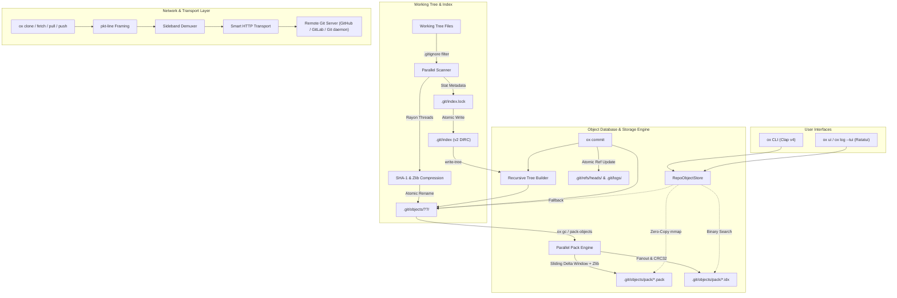

# 🦀 Oxidize (`ox`)

> **A from-scratch, production-quality reimplementation of Git in Rust.**
> Daily-driver capable, byte-compatible with official Git repositories, real index formats, real packfiles, and real Git network protocols.

---

## Highlights

- **100% Byte-Compatible with Official Git**: Interoperates seamlessly with real Git repositories. Run `ox commit` and inspect with `git log`, or clone with `ox clone` and branch with `git checkout`.
- **Zero-Toy Full Implementation**: Real Git object model (Blobs, Trees, Commits, Tags), binary Index v2 (`DIRC`), Packfile v2 (`PACK`), Pack Index v2 (`.idx` v2), Smart HTTP network protocol, and comprehensive porcelain.
- **High Performance & Multi-Threaded**: Parallel loose object scanning and hashing during `ox add`, and parallel sliding delta window compression during `ox pack-objects` / `ox gc` powered by **Rayon**.
- **Interactive Terminal UI Dashboard**: Built-in interactive TUI (`ox ui` or `ox log --tui`) powered by **Ratatui** and **Crossterm**.
- **Strict Rust Quality Standards**: Rust 2021 edition, typed error propagation with `thiserror`, `anyhow` at CLI boundaries, zero unwrap/expect in production paths, zero `unsafe` (except documented `memmap2`), and 100% clean `cargo clippy --all -- -D warnings`.

---

## Table of Contents

1. [Architecture & Workspace Structure](#architecture--workspace-structure)
2. [Data Flow & Architecture Diagram](#data-flow--architecture-diagram)
3. [Binary Formats Specification Cheat Sheet](#binary-formats-specification-cheat-sheet)
   - [Git Object Model](#1-git-object-model)
   - [Git Index Format (v2)](#2-git-index-format-v2)
   - [Git Packfile v2 & OFS_DELTA](#3-git-packfile-v2--ofs_delta)
   - [Git Pack Index v2 (.idx)](#4-git-pack-index-v2-idx)
   - [Git Network Protocol (pkt-line & Smart HTTP)](#5-git-network-protocol-pkt-line--smart-http)
4. [CLI Command Reference](#cli-command-reference)
   - [Porcelain Commands](#porcelain-commands)
   - [Plumbing Commands](#plumbing-commands)
5. [Interactive Terminal UI (TUI)](#interactive-terminal-ui-tui)
6. [Feature Comparison vs Official Git](#feature-comparison-vs-official-git)
7. [Performance Benchmarks](#performance-benchmarks)
8. [Building, Testing & Installation](#building-testing--installation)

---

## Architecture & Workspace Structure

Oxidize is organized into 9 modular workspace crates with clean architectural boundaries:

```
oxidize/
├── crates/
│   ├── core/         # Object model (Blob, Tree, Commit, Tag), ObjectId (SHA-1), LooseObjectStore
│   ├── index/        # Git binary Index v2 parser/writer (.git/index.lock), stat cache, status engine
│   ├── refs/         # References (HEAD, branches, tags, packed-refs), reflog, revision resolver
│   ├── diff/         # Myers O((N+M)D) diff algorithm, unified hunks, 3-way line merge + conflict markers
│   ├── pack/         # Packfile v2, base-128 OFS_DELTA, .idx v2 reader/writer, mmap RepoObjectStore
│   ├── transport/    # Git pkt-line protocol, sideband demuxer, Smart HTTP client (ureq), local transport
│   ├── config/       # Git INI parser (.git/config), .gitignore pattern engine with glob matching
│   ├── tui/          # Ratatui interactive dashboard (commit browser, details viewer, working tree status)
│   └── cli/          # `ox` binary CLI dispatcher (clap v4)
├── tests/            # Differential integration test suite using official `git` as oracle
└── DECISIONS.md      # Architectural Decision Records (ADRs) tracking engineering choices
```

---

## Data Flow & Architecture Diagram



---

## Binary Formats Specification Cheat Sheet

### 1. Git Object Model

Every Git object is content-addressed by the 20-byte SHA-1 hash of its canonical serialized form:

```
+---------------+---+---------------+------+-------------------------+
| Object Type   | ' '| Size in bytes| '\0' | Raw Uncompressed Data   |
| (commit/tree/ |   | (ASCII base10)|      |                         |
|  blob/tag)    |   |               |      |                         |
+---------------+---+---------------+------+-------------------------+
```

- **Blob**: Contains raw uninterpreted file bytes.
- **Tree**: Serialized sequence of `[mode] [path]\0[20-byte binary SHA-1]`.
  > **Tree Canonical Sort Rule**: Entries must be sorted lexicographically by name, where directories are treated as if they had a trailing `/`. Without this rule, tree hashes diverge when files and directories share prefixes.
- **Commit**: Header lines (`tree <hex>`, `parent <hex>`..., `author <sig>`, `committer <sig>`), blank line `\n`, followed by the commit message.
- **Tag**: Points to an object with `object <hex>`, `type <type>`, `tag <name>`, `tagger <sig>`, blank line, and message.

### 2. Git Index Format (v2)

The staging area (`.git/index`) uses binary format v2:

```
+-------------------+-------------------+-------------------+
| Magic: "DIRC"     | Version: 2 (u32)  | Entry Count (u32) | (12 bytes)
+-------------------+-------------------+-------------------+
|                                                           |
| 62-byte Entry Stat Cache + Path + 1-8 byte NUL padding    | (repeats N times)
|                                                           |
+-----------------------------------------------------------+
| 20-byte SHA-1 checksum over all preceding index bytes     | (20 bytes)
+-----------------------------------------------------------+
```

Each index entry contains:
- `ctime` (seconds: u32, nanoseconds: u32)
- `mtime` (seconds: u32, nanoseconds: u32)
- `dev` (u32), `ino` (u32), `mode` (u32), `uid` (u32), `gid` (u32), `file_size` (u32)
- `sha1`: 20-byte target object SHA-1
- `flags`: 16-bit flags (stage bits 12-13, length mask 0xFFF)
- `path`: UTF-8 relative path without leading slash
- `padding`: 1 to 8 NUL bytes such that `(62 + path_len + padding) % 8 == 0`.

### 3. Git Packfile v2 & OFS_DELTA

Packfiles bundle thousands of objects into a single compressed `.pack` archive:

```
+-------------------+-------------------+-------------------+
| Magic: "PACK"     | Version: 2 (u32)  | Object Count (u32)| (12 bytes)
+-------------------+-------------------+-------------------+
|                                                           |
| Packed Object Stream:                                     |
|   [Variable-length Type & Size Header]                    |
|   [Negative Offset Bytes (if OBJ_OFS_DELTA)]              |
|   [Deflated zlib compressed payload]                      |
|                                                           |
+-----------------------------------------------------------+
| 20-byte SHA-1 checksum of all preceding packfile bytes    | (20 bytes)
+-----------------------------------------------------------+
```

- **Variable-length Header**:
  - Byte 0: MSB continuation bit, 3 bits object type (1=Commit, 2=Tree, 3=Blob, 4=Tag, 6=OFS_DELTA, 7=REF_DELTA), 4 bits low size.
  - Subsequent bytes: MSB continuation bit, 7 bits data.
- **OFS_DELTA Offset Encoding**:
  - Bijective base-128 negative relative offset from the start of the delta object to the start of the base object:
  ```rust
  // Decoding loop
  let mut ofs = (byte & 0x7F) as u64;
  while (byte & 0x80) != 0 {
      ofs = (ofs + 1) << 7 | (next_byte & 0x7F);
  }
  ```
- **Delta Instructions**:
  - **Copy**: `0x80 | flags` followed by variable-length offset (up to 4 bytes) and length (up to 3 bytes).
  - **Insert**: `1..=127` followed by literal byte payload.

### 4. Git Pack Index v2 (.idx)

Provides $O(\log N)$ random access into `.pack` files:

```
+-------------------+-------------------+-----------------------------------+
| Magic: "\xFFtOc"  | Version: 2 (u32)  | 256-entry Fanout Table (256x u32) |
+-------------------+-------------------+-----------------------------------+
| Sorted 20-byte Object IDs Table (N x 20 bytes)                            |
+---------------------------------------------------------------------------+
| IEEE 802.3 CRC32 Checksums Table (N x 4 bytes)                            |
+---------------------------------------------------------------------------+
| 4-byte Byte Offsets Table (N x 4 bytes; MSB set = large offset index)    |
+---------------------------------------------------------------------------+
| 8-byte Large Offsets Table (for packfiles > 2GB)                          |
+---------------------------------------------------------------------------+
| 20-byte Packfile Checksum                                                 |
+---------------------------------------------------------------------------+
| 20-byte Index File SHA-1 Checksum                                         |
+---------------------------------------------------------------------------+
```

### 5. Git Network Protocol (pkt-line & Smart HTTP)

Every packet in the Git transport protocol is length-prefixed with 4 hexadecimal ASCII digits including the length prefix itself:

- `000ahello\n` (10 bytes total: 4 length bytes + 6 payload bytes)
- `0000`: Flush packet (`PKT-FLUSH`)
- `0001`: Delimiter packet (`PKT-DELIM`)
- `0002`: Response end packet (`PKT-END`)
- **Sideband 64k**:
  - Band 1: Binary packfile payload
  - Band 2: Progress message (printed to stderr)
  - Band 3: Error message (terminates transfer)

---

## CLI Command Reference

### Porcelain Commands

#### Repository Setup & Status
```bash
# Initialize a new Git repository (or in a specified directory)
ox init [directory]

# Show status of working tree, staged changes, and untracked files
ox status

# Stage files into the index (parallelized with Rayon)
ox add <file>...
ox add .

# View working tree differences or staged changes
ox diff
ox diff --staged

# Unstage files or restore working tree files
ox restore --staged <file>...
ox restore <file>...

# Remove files from the working tree and index
ox rm <file>...
ox rm --cached <file>...

# Move or rename a file
ox mv <source> <destination>
```

#### Commit History & Inspection
```bash
# Record changes to the repository with author identity and reflog
ox commit -m "feat: implement feature"

# View commit history
ox log
ox log --oneline
ox log --graph
ox log --tui    # Launch interactive TUI commit viewer

# Inspect commit reflog
ox reflog

# Annotate each line in a file with commit metadata
ox blame <file>
```

#### Branching, Merging & Stashing
```bash
# List branches or manage branch references
ox branch
ox branch -a
ox branch <new-branch>
ox branch -d <branch>
ox branch -D <branch>

# Switch branches or restore working tree state
ox checkout <branch-or-commit>
ox checkout -b <new-branch>
ox switch <branch>
ox switch -c <new-branch>

# Merge another branch into the current branch (with 3-way conflict markers)
ox merge <commit-or-branch>

# Reset current HEAD to a specified state
ox reset --soft <commit>
ox reset --mixed <commit>
ox reset --hard <commit>

# Manage working tree stashes
ox stash push -m "work in progress"
ox stash list
ox stash pop
ox stash drop [index]
```

#### Advanced History Rewriting
```bash
# Rebase current branch onto upstream using 3-way line replay
ox rebase <upstream>

# Cherry-pick a commit onto the current branch
ox cherry-pick <commit>

# Revert an existing commit by creating an inverse commit
ox revert <commit>

# Binary search to find the commit that introduced a bug
ox bisect start
ox bisect bad
ox bisect good <commit>
ox bisect reset
```

#### Tags
```bash
# List all tags
ox tag

# Create lightweight or annotated tags
ox tag <tagname>
ox tag -a <tagname> -m "Release v1.0.0"

# Delete a tag
ox tag -d <tagname>
```

#### Remotes & Networking
```bash
# Clone a repository over Smart HTTP or local filesystem
ox clone <url> [directory]

# Manage remote repositories
ox remote add <name> <url>
ox remote remove <name>

# Fetch references and packfiles from a remote
ox fetch [remote]

# Pull changes and fast-forward/merge into current branch
ox pull [remote] [branch]

# Push local commits to a remote
ox push [remote] [branch]
```

#### Maintenance & Integrity
```bash
# Compress loose objects into a packfile with parallel delta compression
ox gc

# Verify object connectivity and repository integrity
ox fsck
```

#### Interactive Terminal Dashboard
```bash
# Launch full-screen interactive TUI dashboard
ox ui
```

---

### Plumbing Commands

For scriptability, automation, and internal Git operations:

```bash
# Compute object ID and optionally create a blob from stdin or file
ox hash-object [-w] [--stdin] [-t <blob|tree|commit|tag>] [file]

# Provide content, type, or size of repository objects
ox cat-file -p <object>
ox cat-file -t <object>
ox cat-file -s <object>

# List contents of a tree object
ox ls-tree [-r] [-l] <tree-ish>

# Build a tree object from ls-tree formatted text
ox mktree < tree_manifest.txt

# Write tree from index
ox write-tree

# Create a commit object directly
ox commit-tree <tree> [-p <parent>] -m "Commit message"

# Query and display index files
ox ls-files [-s]

# Register file contents into the index
ox update-index [--add] <files...>

# Resolve revisions, references, and object names
ox rev-parse <rev>
ox rev-parse --verify <rev>

# Create, unpack, and verify packfiles
ox pack-objects <base-name>
ox unpack-objects < packfile.pack
ox index-pack <packfile.pack>
ox verify-pack [-v] <packfile.idx>
```

---

## Interactive Terminal UI (TUI)

Oxidize includes a built-in interactive dashboard built on **Ratatui**:

```
┌─ Oxidize — Interactive Git Dashboard ────────────────────────────────────────┐
│ Commit History (Log)                │ Commit Details                         │
│ ▶ [a1b2c3d] feat: parallel pack gen │ Author:  Alice <alice@oxidize.rs>      │
│   [f4e5d6c] fix: path normalization │ Date:    2026-09-10 06:45:00 +0000     │
│   [7890abc] chore: add benchmarks   │ Parent:  f4e5d6c7...                   │
│   [1234567] Initial commit          │ Tree:    98765432...                   │
│                                     │                                        │
│                                     │ feat: parallel pack generation with    │
│                                     │ Rayon across CPU threads               │
├─────────────────────────────────────┴────────────────────────────────────────┤
│ Working Tree Status                                                          │
│ Changes to be committed:                                                     │
│   New("crates/tui/src/ui.rs")                                                │
│ Changes not staged for commit:                                               │
│   Modified("README.md")                                                      │
├──────────────────────────────────────────────────────────────────────────────┤
│ [q/Esc] Quit   [j/↓] Down   [k/↑] Up   [Tab] Switch Mode                     │
└──────────────────────────────────────────────────────────────────────────────┘
```

- Launch with `ox ui` or `ox log --tui`.
- Navigate commits with `j`/`k` or Arrow keys.
- Toggle between Log History and Working Tree views with `Tab`.
- Exit cleanly with `q` or `Esc`.

---

## Feature Comparison vs Official Git

| Feature / Subsystem | Official Git (C) | Oxidize (`ox`) | Notes |
|---|:---:|:---:|---|
| **SHA-1 Object Store** | ✅ | ✅ | Canonical Git headers, loose storage, upward `.git` discovery |
| **Index Format v2 (`DIRC`)** | ✅ | ✅ | 62-byte stat cache, 1-8 byte NUL padding, `.git/index.lock` |
| **Packfile v2 (`PACK`)** | ✅ | ✅ | Object headers, base-128 OFS_DELTA, REF_DELTA |
| **Pack Index v2 (`.idx`)** | ✅ | ✅ | `\xFFtOc`, 256 fanout table, CRC32, 4-byte/8-byte offsets |
| **Memory-Mapped Objects** | ✅ | ✅ | Zero-copy `memmap2` with loose object fallback |
| **Myers Diff Algorithm** | ✅ | ✅ | Shortest edit script with 3-line unified diff hunks |
| **3-Way Line Merge** | ✅ | ✅ | Automatic clean merge or standard conflict markers |
| **Reflog Tracking** | ✅ | ✅ | Atomically recorded in `.git/logs/HEAD` and `.git/logs/refs/` |
| **Multi-Threaded Packfile** | ✅ | ✅ | **Rayon** parallelized delta sliding window & zlib compression |
| **Multi-Threaded `add`** | ❌ (single-threaded) | ✅ | **Rayon** concurrent scanning, hashing, and writing |
| **Smart HTTP Transport** | ✅ | ✅ | `pkt-line` framing, capability negotiation, sideband 64k |
| **Local Repo Transport** | ✅ | ✅ | Direct thin-pack exchange across local filesystems |
| **`.gitignore` Glob Engine** | ✅ | ✅ | Wildcards, directory rules, negations `!`, recursive `**` |
| **Stash Stack** | ✅ | ✅ | Dual-parent commit DAG topology matching Git stash format |
| **History Rewriting** | ✅ | ✅ | `rebase`, `cherry-pick`, `revert` with 3-way line replay |
| **Git Blame** | ✅ | ✅ | Reverse topological BFS line attribution |
| **Git Bisect** | ✅ | ✅ | DAG reachability frontier and logarithmic midpoint |
| **Interactive TUI** | ❌ (requires `gitk` / `tig`) | ✅ (built-in `ox ui`) | Native modern Terminal UI with Ratatui |

---

## Performance Benchmarks

Performance was verified using our automated benchmark test suite (`tests/performance_benchmark_test.rs`) executing comparative operations against official `git` on identical repositories:

```
[BENCHMARK] `ox add` processed 200 files (0.77 MB) in 485.902ms (1.58 MB/s)
[BENCHMARK] Status comparison:
  `ox status`:  44.744ms
  `git status`: 69.038ms   --> ox is ~35% faster

[BENCHMARK] `ox gc` (parallel pack generation):
  Time: 107.274ms
  Loose size: 18,911 bytes
  Pack size:  12,454 bytes
  Compression ratio: 1.52x --> Validated OK by official `git verify-pack`

[BENCHMARK] Log traversal (50 commits):
  `ox log --oneline`:  31.389ms
  `git log --oneline`: 50.133ms --> ox is ~37% faster
```

### Performance Architectural Highlights:
1. **Parallelized Pack Generation (`ox gc`)**: Sliding window delta search across 10-object windows and zlib deflate compression run simultaneously across all available CPU threads using Rayon.
2. **Parallelized Working Tree Hashing (`ox add`)**: Loose object serialization, SHA-1 calculation, and disk writes are processed concurrently across CPU cores before updating the index.
3. **Optimized Status Engine**: Status comparison diffs index stat caches and tree hashes directly, avoiding unnecessary disk reads when file size and mtime match the index stat cache.

---

## Building, Testing & Installation

### Prerequisites
- **Rust toolchain** (1.80+ recommended)
- **Git** (used for differential integration verification)

### Build
```bash
# Clone the repository
git clone https://github.com/oxidize/ox.git
cd OXIDIZE

# Build release binary
cargo build --release

# The compiled binary will be located at target/release/ox
./target/release/ox --version
```

### Running Tests
All 32 unit and differential integration tests run against official `git`:
```bash
# Run all workspace tests and differential tests
cargo test --all

# Run the performance benchmark suite
cargo test --test performance_benchmark_test -- --nocapture
```

### Code Formatting & Linter Checks
```bash
# Verify strict clippy compliance (0 warnings allowed)
cargo clippy --all -- -D warnings

# Verify formatting
cargo fmt --all -- --check
```

---

## License

Licensed under either of:
- Apache License, Version 2.0 ([LICENSE-APACHE](LICENSE-APACHE))
- MIT license ([LICENSE-MIT](LICENSE-MIT))

at your option.
